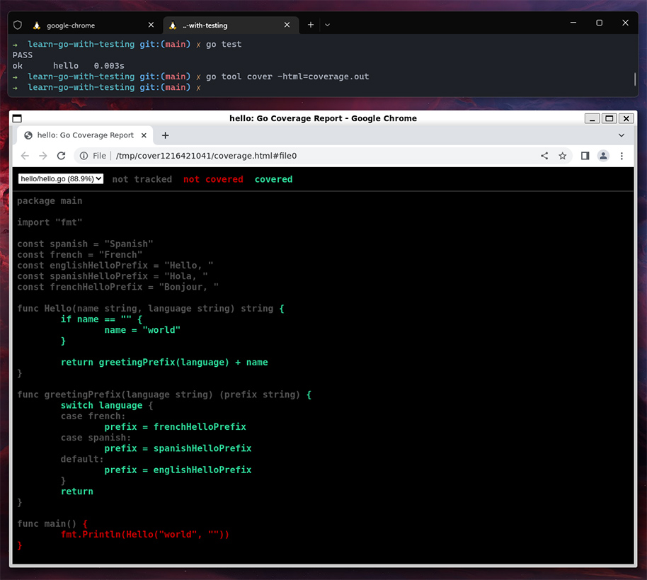

When running Go tests, you can see your test coverage by running `go test -cover`.

You can also generate a coverage report with
 
`go test -coverprofile=coverage.out`

To open the generated report as an html file, run:
 
`go tool cover -html=coverage.out`

This is where WSL failed for me; nothing opened, and there was no output. WSL will usually, in my experience, have no problem opening your Windows default browser when running things like Node servers.

I tried setting the `$BROWSER` environment variable to `wslview`, which is supposed to set the default browser to your Windows default browser, but that didn't work.

Trying a different workaround, I followed these instructions to install Chrome for Linux (requires WSL 2 and Windows 11 Build 22000):
 
[Run Linux GUI apps with WSL | Microsoft Learn](https://learn.microsoft.com/en-us/windows/wsl/tutorials/gui-apps)

TLDR:

- Updated WSL with `wsl --update` and `wsl --shutdown` to restart
- Ran `sudo apt update`
- Installed Chrome:
  - `cd /tmp`
  - `sudo wget https://dl.google.com/linux/direct/google-chrome-stable_current_amd64.deb`
  - `sudo dpkg -i google-chrome-stable_current_amd64.deb`
    - Here I ran into a dependency error, and ran `sudo apt-get install -f` (`f` for fix broken dependencies), but you can skip this. I didn't realize the instructions accounted for this.
  - Instead, it says to run `sudo apt install --fix-broken -y`
  - Then run `sudo dpkg -i google-chrome-stable_current_amd64.deb` again.

To set Chrome as the default browser I added
 
`export BROWSER=/bin/google-chrome`
 
to my `.zshrc`.

Now the cover command opens the Linux GUI app as expected.

